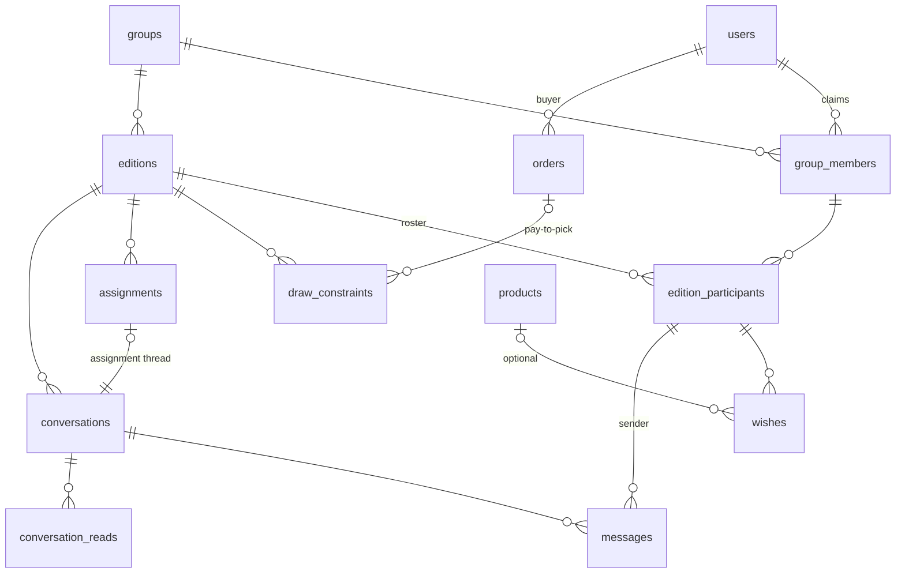

# Data Model — Hey Brother Secreto

**Status:** Approved design · 2026-07-11
**Scope:** Core data model for groups, editions, draws, wishes, chat, and monetization hooks. Backend is Laravel (SQLite in dev); IDs are big-integer auto-increment; all tables have `created_at`/`updated_at` unless noted.

## Overview

The model is **membership-anchored**: `group_members` is the stable identity of a person inside a group, whether or not they have registered. Everything that must survive across editions (draw history, admin roles) hangs off `group_members`; everything scoped to a single edition (wishes, assignments, messages, constraints) hangs off `edition_participants`, which trace back to members.

### Identity levels

| Level | Table | Answers | Lifetime |
|---|---|---|---|
| Account | `users` | who are you globally | forever |
| Member | `group_members` | who are you in this group | forever (never deleted; `inactive` on leave) |
| Participant | `edition_participants` | are you in this edition | per edition |

A person flows downward: a user claims a member row; a member joins an edition roster. Draw history joins `assignments → edition_participants → group_members`, so repeat-avoidance works even for people who registered years after their first edition.

---

## 1. Identity & Groups

### `users`

Registered accounts. Laravel defaults (`name`, `email` unique, `password`, etc.) plus:

| Column | Type | Notes |
|---|---|---|
| `locale` | string | default `pt-BR`; all user-facing content is i18n'd |

Mobile app authenticates with Sanctum tokens. Social login can be added later without schema impact beyond a nullable `password`.

### `groups`

| Column | Type | Notes |
|---|---|---|
| `name` | string | |
| `description` | text, nullable | |
| `created_by` | FK → users | |
| `deleted_at` | timestamp, nullable | soft delete |

### `group_members`

The anchor entity: one row per person per group.

| Column | Type | Notes |
|---|---|---|
| `group_id` | FK → groups | |
| `user_id` | FK → users, **nullable** | null = unclaimed placeholder |
| `display_name` | string, nullable | group-scoped nickname; falls back to `users.name` |
| `email` | string, nullable | where the invite goes; not required for placeholders |
| `role` | enum `admin` \| `member` | a group can have any number of admins |
| `invite_token` | string, unique | claim flow: register/login → open invite link → set `user_id` |
| `status` | enum `invited` \| `active` \| `inactive` | leaving a group sets `inactive` — rows are **never deleted** because history references them |
| `joined_at` | timestamp, nullable | when claimed/joined |

Constraints: unique `(group_id, user_id)` where `user_id` is not null.

**Claiming:** an admin adds "João" by name (and optionally email) → placeholder row. When João registers and opens his invite link, `user_id` is set on that same row — every past edition, assignment, and wish he already had stays attached.

---

## 2. Editions & Types

### `editions`

One Secret Santa run within a group.

| Column | Type | Notes |
|---|---|---|
| `group_id` | FK → groups | |
| `name` | string | e.g. "Natal 2026" |
| `type` | string | e.g. `classic`; resolves to an algorithm via a code registry |
| `status` | enum `draft` \| `open` \| `drawn` \| `revealed` \| `archived` | see lifecycle |
| `budget_cents` | int, nullable | suggested gift budget |
| `currency` | string(3) | default `BRL` |
| `event_date` | date, nullable | the party |
| `settings` | json | type-specific knobs (e.g. history lookback depth) |
| `drawn_at` | timestamp, nullable | |
| `revealed_at` | timestamp, nullable | |
| `created_by` | FK → users | |

**Lifecycle:** `draft` (admins set up roster/rules) → `open` (participants confirmed, wishes being added) → `drawn` (assignments exist; anonymous chats active) → `revealed` (assignments public; chat unmasked) → `archived`.

### `edition_participants`

Per-edition roster, seeded from active group members and editable until the draw.

| Column | Type | Notes |
|---|---|---|
| `edition_id` | FK → editions | |
| `group_member_id` | FK → group_members | |

Constraints: unique `(edition_id, group_member_id)`.

All per-edition data (wishes, assignments, constraints, messages) references `edition_participants.id`, never `group_members` or `users` directly — cross-edition mix-ups become structurally impossible, while history still traces back through the member.

### Edition types & pluggable algorithms (code contract, not tables)

- `editions.type` is a string resolved through a registry (`EditionTypeRegistry`) to a `DrawAlgorithm` implementation.
- Contract — input: the roster (`edition_participants`), active constraints, and **history**: past giver→receiver pairs among the same `group_members` from the group's previous editions, weighted by recency. Output: a complete set of assignments, or a domain failure ("no valid draw exists") the UI can explain.
- Adding a type = new registry entry + algorithm class + optional `settings` keys. Zero schema change.
- Launch type: `classic` — single cycle-or-permutation draw that minimizes repeat pairs and honors all constraints.

---

## 3. The Draw

### `draw_constraints`

Rules the algorithm must honor, scoped to an edition.

| Column | Type | Notes |
|---|---|---|
| `edition_id` | FK → editions | |
| `type` | enum `must_not_pair` \| `must_pair` | `must_not_pair` is enforced **symmetrically** (couples); `must_pair` is directional (giver → receiver) |
| `giver_edition_participant_id` | FK → edition_participants | for `must_not_pair`, "participant A" |
| `receiver_edition_participant_id` | FK → edition_participants | for `must_not_pair`, "participant B" |
| `source` | enum `admin` \| `purchase` | |
| `order_id` | FK → orders, nullable | set when `source = purchase` |
| `created_by` | FK → users, nullable | the admin, when `source = admin` |

**Pay-to-pick is a paid `must_pair` constraint:** it participates in the draw only while its order is `paid`. No future schema change needed to ship the feature.

Recurring exclusions (couples, siblings) are handled with a "copy constraints from previous edition" convenience at edition setup — one table, one scope, no group-level rule engine.

### `assignments`

The draw result.

| Column | Type | Notes |
|---|---|---|
| `edition_id` | FK → editions | |
| `giver_edition_participant_id` | FK → edition_participants | unique per edition |
| `receiver_edition_participant_id` | FK → edition_participants | unique per edition |

Constraints: unique `(edition_id, giver_edition_participant_id)` and unique `(edition_id, receiver_edition_participant_id)` — the classic one-gives-one-receives shape. A future type that breaks this shape revisits these DB constraints explicitly.

**Repeat-avoidance** is a query, not a table: past `assignments` in the group's earlier editions, joined through `edition_participants` back to `group_member` IDs, produce a penalty matrix the algorithm minimizes against.

---

## 4. Wishes & Affiliate Products

### `products`

Cached catalog entries fetched from affiliate provider APIs; shared across wishes.

| Column | Type | Notes |
|---|---|---|
| `provider` | string | slug: `amazon`, `mercadolivre`, … — provider registry (credentials, API client) lives in code/config, mirroring the edition-type registry pattern |
| `external_id` | string | provider's product ID |
| `title` | string | |
| `url` | string | canonical product URL |
| `affiliate_url` | string, nullable | monetized URL |
| `price_cents` | int, nullable | |
| `currency` | string(3) | |
| `image_url` | string, nullable | |
| `raw` | json | full provider payload |
| `fetched_at` | timestamp | staleness marker for re-sync |

Constraints: unique `(provider, external_id)`.

### `wishes`

| Column | Type | Notes |
|---|---|---|
| `edition_participant_id` | FK → edition_participants | |
| `description` | text | free text, always present |
| `product_id` | FK → products, nullable | set when the participant picked a concrete product via provider search |
| `sort_order` | int | participant-defined priority |

Many wishes per participant per edition. Wishes are per-edition by design (budgets and desires change yearly); a "copy from last year" convenience can be added without schema change. Wish visibility (everyone vs. only your santa) is an application-layer rule.

---

## 5. Chat

### `conversations`

| Column | Type | Notes |
|---|---|---|
| `edition_id` | FK → editions | |
| `type` | enum `edition` \| `assignment` | |
| `assignment_id` | FK → assignments, nullable, unique | set only for `assignment` type |

One `edition` conversation is created with the edition (all participants). One `assignment` conversation per assignment is created at draw time (exactly two members: giver and receiver).

### `messages`

| Column | Type | Notes |
|---|---|---|
| `conversation_id` | FK → conversations | |
| `sender_edition_participant_id` | FK → edition_participants | always the **true** sender |
| `body` | text | |

**Anonymity is presentation, not schema.** In an `assignment` conversation, while the edition is not `revealed`, the giver's messages render as "Seu amigo secreto" to the receiver; the receiver's messages render normally (the giver knows who they drew). At reveal, names unmask — full history, no migration. The API layer is responsible for never leaking the giver's identity in payloads before reveal.

### `conversation_reads`

Unread tracking for the mobile app.

| Column | Type | Notes |
|---|---|---|
| `conversation_id` | FK → conversations | |
| `edition_participant_id` | FK → edition_participants | |
| `last_read_at` | timestamp | |

Constraints: unique `(conversation_id, edition_participant_id)`.

Attachments and reactions are explicitly out of scope for v1.

---

## 6. Payments

### `orders`

Provider-agnostic, single-purpose purchase records.

| Column | Type | Notes |
|---|---|---|
| `user_id` | FK → users | buyer |
| `edition_id` | FK → editions | context |
| `type` | string | only `pick_purchase` initially |
| `amount_cents` | int | |
| `currency` | string(3) | default `BRL` |
| `status` | enum `pending` \| `paid` \| `failed` \| `refunded` | |
| `payment_provider` | string | `mercadopago`, `stripe`, … |
| `provider_reference` | string, nullable | provider's charge/payment ID |
| `paid_at` | timestamp, nullable | |
| `metadata` | json | provider payloads, feature-specific data |

Flow: buyer creates a `pick_purchase` order → payment webhook flips `status` to `paid` → the linked `draw_constraints` row (`source = purchase`) becomes active for the draw. A `refunded` order deactivates its constraint (application rule, pre-draw only).

No `order_items` table: orders are single-purpose. If bundles ever appear, add items then.

---

## Future extensions (documented, not built)

- **`affiliate_clicks`** — attribution table (`wish_id`/`product_id`, `edition_participant_id` clicker, timestamp, provider) when affiliate revenue tracking becomes real.
- **Open DMs** — non-anonymous member-to-member conversations; fits by adding a `dm` conversation type + a participants table.
- **Profile-level wishlist** — a reusable user wishlist feeding per-edition wishes.
- **Per-assignment reveal** — `revealed_at` on `assignments` if individual unmasking is ever wanted (edition-level reveal was chosen for v1).
- **Guest access** — magic-link tokens for never-registered participants; `group_members.invite_token` is the natural seam.

## Decision log

| Decision | Choice |
|---|---|
| Unregistered participants | Invited placeholders: `group_members.user_id` nullable, claimed via invite token |
| Edition roster | Per-edition (`edition_participants`), seeded from group, editable pre-draw |
| Draw constraints | Exclusions (symmetric) + forced picks (directional), one table, edition-scoped |
| Wish scope | Per participant per edition |
| Wish shape | Free text + optional linked affiliate product |
| Chat | Edition-wide channel + one anonymous thread per assignment; anonymity at presentation layer |
| Reveal | Edition-level; unmasks assignments and chat |
| Monetization | Orders table now (pay-to-pick ready); affiliate click tracking later |
| Identity model | Membership-anchored (Approach A) over global-person and edition-flat alternatives |
